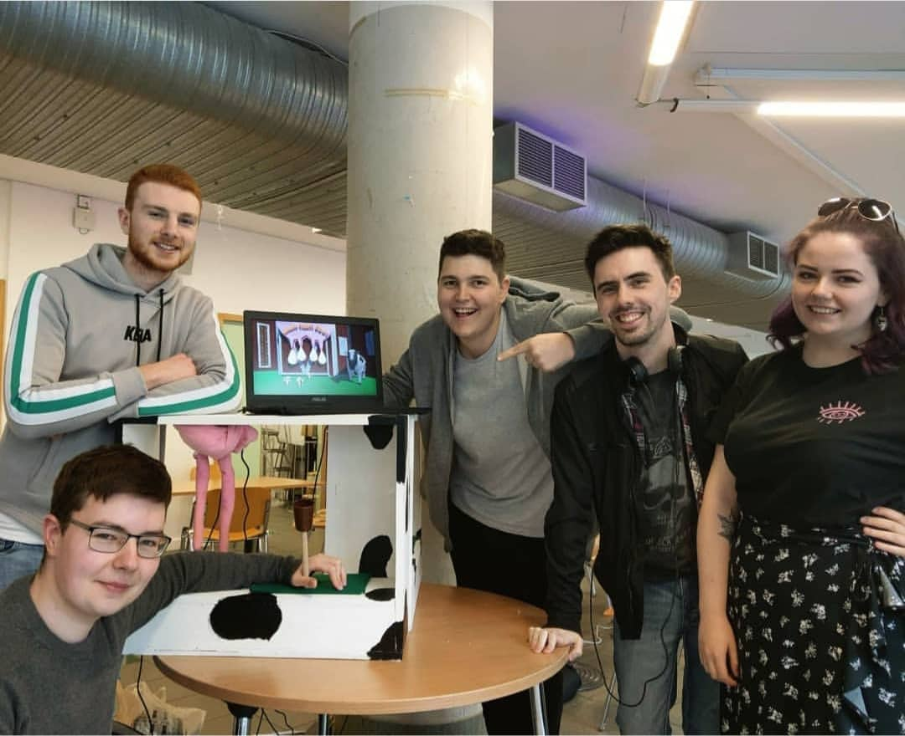
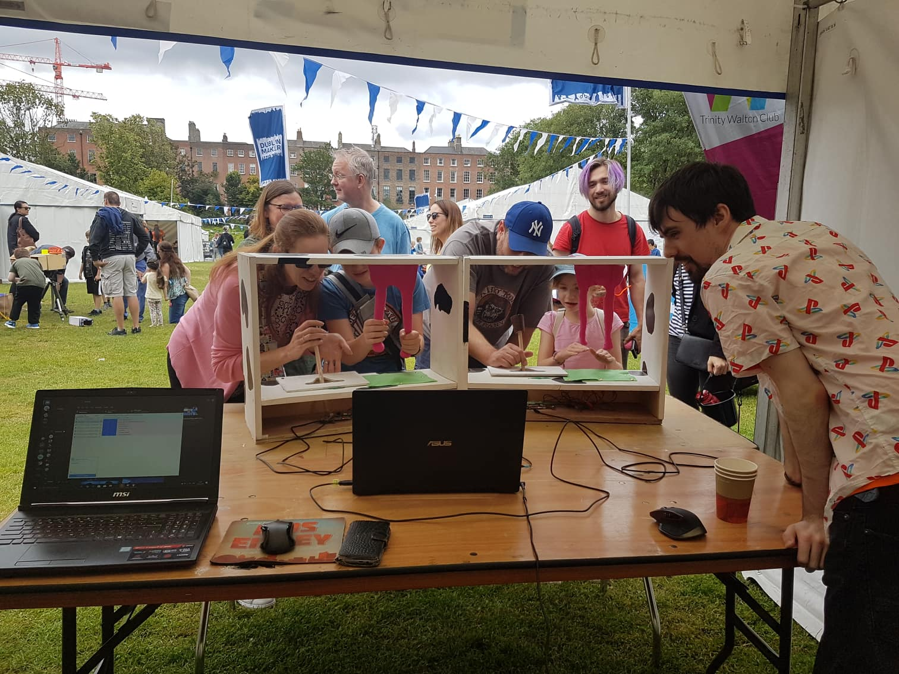

# Milk! That! Cow!
Milk! That! Cow! was a three-week prototype that ended up getting accepted at GDC AltCtrl 2020 (https://gdconf.com/news/check-out-20-unique-games-youll-play-gdc-2020s-altctrlgdc-showcase) and Dublin Makers Fair 2019.

## Project Description
“Milk! That! Cow!” is a competitive milking simulator, where two teams compete to drink the most buckets of milk. The game was made with a custom controller in mind. The custom controller was made out of a disassembled knock off PS3 controller and custom buttons were set up using wires and crocodile clips. The game was made to be played two versus two, with each team sharing a milking booth controller. The idea was centred around a crazy TV show where two teams had to milk a cow as fast as possible in front of a live studio audience.

A gameplay breakdown and controller showcase can be seen here:

After “Milk! That! Cow!” initial creation, it was showcased in TU Dublin’s end of year game showcase. There, the team and myself were approached to submit the project to Dublin Maker Fair. This is a fair dedicated to showcasing custom creations and inventions. Their website describes the event as “a family-friendly showcase of invention, creativity and resourcefulness, and a celebration of the maker movement”. We showcased the project at the fair in 2019.

In late 2019 we decided to submit the game to GDC AltCtrl in San Francisco. For the game submission, we created a Trailer for the game. We decided to embrace the games silly concept and “stupid fun” of the game for the trailer. The trailer was shot in TU Dublin’s AR and VR testing lab in front of a green screen.

The submission got accepted and we planned to fly San Francisco in Spring of 2020. Because of the Covid 19 pandemic, all GDC on-site events were cancelled and our trips with it. However, we are all still incredibly proud of how this silly project and how successful it ended up being.

## Usage Help
Feel free to fork this repo if you want to play around with the project. However, because of the projects Alternate Controller aspect, much of the project’s charm is lost without the two one of a kind milking controllers.
